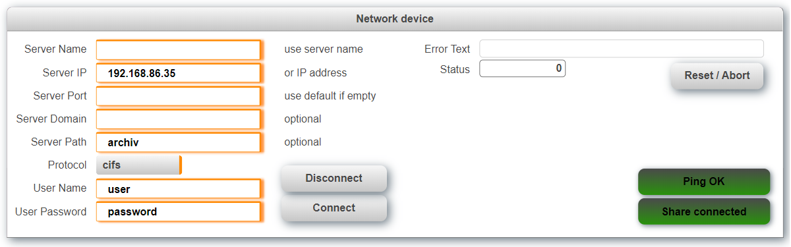

## Table of Contents
* [Introduction](#Introduction)
* [Requirements](#Requirements)
* [Description](#Description)
* [Revision History](#Revision-History)

## Introduction
This is a sample project for mounting a network share on a B&R PLC. The task creates a file device with the name "NET_DEVICE". This device name can the be used with all libraries that support files devices, e.x. FileIO.

Download the latest release from [**here.**](https://github.com/br-automation-com/AS-NET/releases) 

The task uses a variable structure to communicate with the outside world that can also be used to interact with other tasks. The structure* looks as follows:

<table>
  <tr>
    <td width=100>Level 1</td>
    <td>Level 2</td>
    <td>Level Description</td>
  </tr>
  <tr style="font-weight:bold">
    <th>CMD</th>
    <td colspan="3">Used to trigger commands.</td>
  </tr>
  <tr>
   <td></td>
   <td>connect</td>
   <td colspan="3">Connect to network share</td>
  </tr>
  <tr>
   <td></td>
   <td>disconnect</td>
   <td colspan="3">Disconnect from network share</td>
  </tr>
  <tr>
   <td></td>
   <td>error_reset</td>
   <td colspan="3">Reset pendiing errors</td>
  </tr>
    <th> PAR </th>
    <td colspan="3">Parameters tructure</td>
  </tr>
   <tr>
   <td></td>
   <td>server_name</td>
   <td colspan="3">Name of the network share. Use this name or IP address</td>
  </tr>
    <tr>
   <td></td>
   <td>server_ip</td>
   <td colspan="3">IP address ofthe network share. Use IP address or network name.</td>
  </tr>
    <tr>
   <td></td>
   <td>server_port</td>
   <td colspan="3">Port on the network target. Leave empty to use default port.</td>
  </tr>
      <tr>
   <td></td>
   <td>server_protocol</td>
   <td colspan="3">Type of network connection. Use ftp, cifs, nfs or tftp.</td>
  </tr>
      <tr>
   <td></td>
   <td>server_domain</td>
   <td colspan="3">Domain name.</td>
  </tr>
      <tr>
   <td></td>
   <td>server_share</td>
   <td colspan="3">Name of the network share on the target.</td>
  </tr>
      <tr>
   <td></td>
   <td>user_name</td>
   <td colspan="3">User name.</td>
  </tr>
      <tr>
   <td></td>
   <td>user_password</td>
   <td colspan="3">User password.</td>
  </tr>
        <tr>
   <td></td>
   <td>enable_connect</td>
   <td colspan="3">Used to enable/disable the connect and disconnect button in HMI.</td>
  </tr>
          <tr>
   <td></td>
   <td>can_ping</td>
   <td colspan="3">Indicates that the network share can be pinged.</td>
  </tr>
        <tr>
   <td></td>
   <td>is_linked</td>
   <td colspan="3">Indicates that the network share is linked.</td>
  </tr>
   <tr>
    <th> ERR </th>
    <td colspan="3">Information about errors</td>
  </tr>
   <tr>
   <td></td>
   <td>no</td>
   <td colspan="3">Error number</td>
  </tr>
  <tr>
   <td></td>
   <td>state</td>
   <td colspan="3">State where the error occurred</td>
  </tr>
  <tr>
   <td>status</td>
   <td colspan="3">Cuurent status</td>
  </tr>
</table>

## Requirements
* Automation Studio 4.5
* Automation Runtime D4.52

Recommended task class is #8 with a 10ms cycle time.

## Revision History

#### Version 0.3
- Remove state variable from PAR structure
- Added status variable to main structure
- Added disconnect command
- Ping is now executed all the time to detect connection interruption

#### Version 0.2
- Added ping support

#### Version 0.1
- Initial commit
